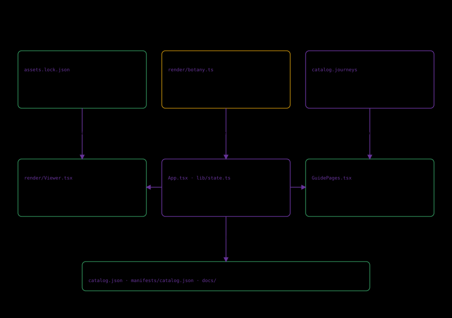

# System and lane boundaries

FLORARIA joins a locked museum corpus, named teaching hierarchy and sourced investigations. One state record connects them. The scan lane supplies an observed surface; anatomy supplies an authored explanation. Changing lanes changes evidence type.

The offline process acquires exact files, validates content and inspects GLB structure. It exports a browser catalog/manifest. The frontend loads fixed artifacts and renders the selected object. Acquisition does not happen per visitor.

App.tsx owns exploration; lib/state.ts validates views; lib/catalog.ts validates published records. Viewer.tsx manages the scene and botany.ts defines components. GuidePages.tsx supplies supporting routes and opens real investigation states.

The shared frame provides header/footer, language/theme and architecture dialog. Expanded viewing is a reversible mode, not a second app. No account store, server or learned engine is needed. A future predictive/authenticated feature requires a new explicit evidence/operations contract.
