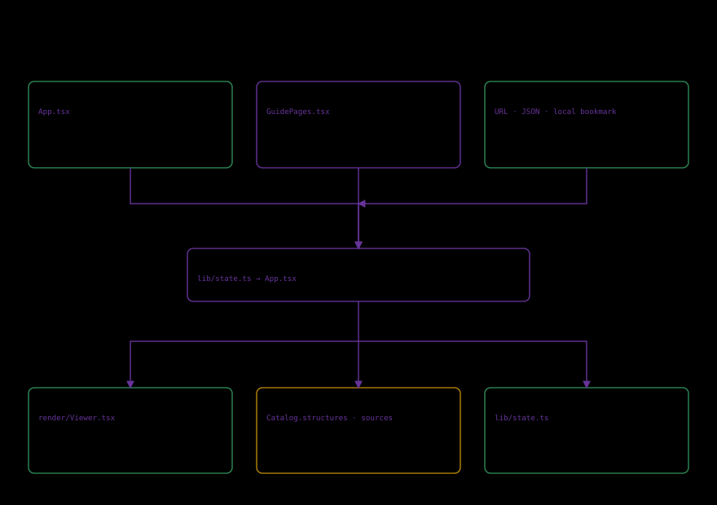

# State and deterministic presentation

Stable IDs connect specimens/files, components/explanations and investigations/views. Translated labels are not keys.

Journey views specify mode, model, specimen/comparison IDs, component, explosion, clipping and progress. lib/state.ts owns valid values and normalization. Links/imports pass that boundary; parsing JSON alone is insufficient. Unknown identifiers revert to supported defaults; finite numbers are clamped and nonfinite values use defaults. Model-incompatible selections are cleared. Invalid import envelopes and files larger than 64 KB are rejected. Camera presets persist; free camera orbit does not.

$$S'=V(D(E(S))).$$

S is supported state, E encoding, D decoding and V validation. Accepted semantic fields in S' must match S; key order is irrelevant. Unknown IDs must not become unrelated evidence.

$$\mathbf{x}(u)=(1-u)\mathbf{x}_0+u\mathbf{x}_1,\quad u\in[0,1].$$

Endpoints are authored and u is display progress, not a growth rate or biological time. Colors, offsets and event positions are conventions.

Bookmarks belong to browser storage. Links/JSON carry a view, not an account. Images are presentations, not measurements. Tests check semantic restoration, corrupt inputs and ranges. See [validation](05_validation.md).
