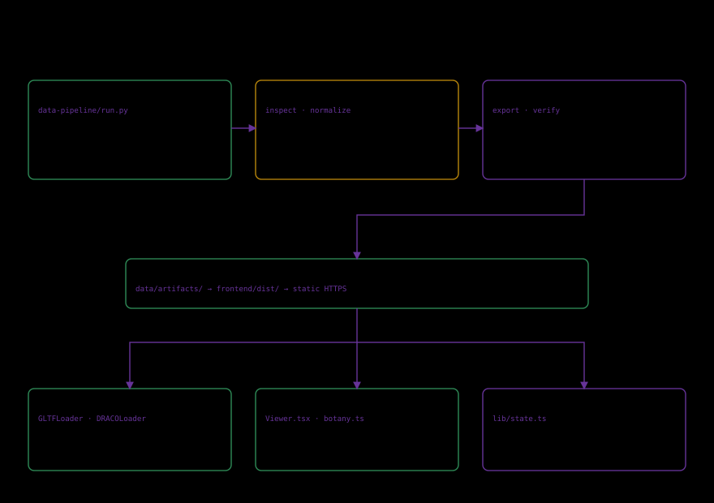

# Source processing

data-pipeline/run.py is plain tooling invoked by path, not an internal package. Stages acquire, validate-source, inspect, normalize, export and verify.

data/sources/catalog-source.json owns content; assets.lock.json fixes URLs/bytes/hashes. Outputs are data/artifacts/catalog.json, geometry and manifests/catalog.json. See [contracts](../data-contract.md).

~~~sh
python data-pipeline/run.py all
python data-pipeline/run.py verify
~~~

--offline uses verified cache. --root PATH selects the entire input/output sandbox. Seed its data/sources and verified data/raw/assets before use; read --help for flags. Independent normalization writes an ignored intermediate.

Do not change a lock just to silence mismatch. Reacquire officially, inspect the change and rights, then update lock/evidence together. Current online content is not automatically an earlier release's content.

Tests use separate roots. Explicit release processing prepares canonical outputs. Build/deploy validate and copy them rather than fetch changing museum content.
