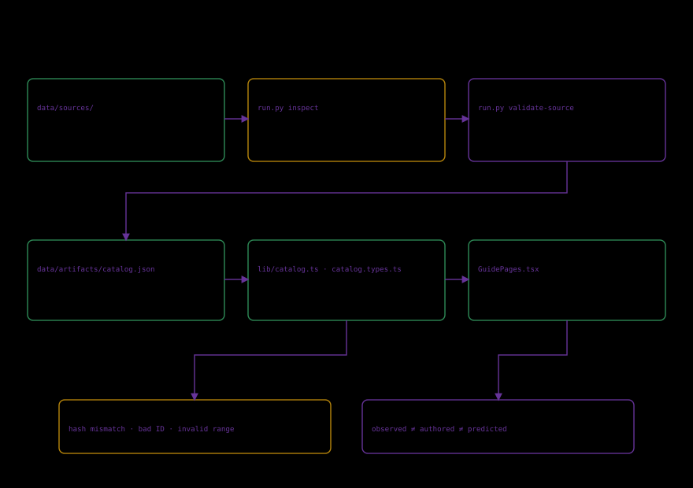

# Validation and evidence

Different checks establish different facts.



| Check | Establishes | Does not establish |
|---|---|---|
| SHA-256/bytes | Locked-file match | Botanical truth |
| GLB inspection | Supported declared structure/counts | Hidden anatomy |
| Catalog validation | IDs/references/languages/ranges agree | Scientific validity of every claim |
| Component check | Advertised authored parts exist | Natural proportions |
| State round trip | Controls/selection restore | Biological measurements |
| Browser QA | Advertised behavior | Educational effectiveness |

$$C=\frac{|R_{present}\cap R_{required}|}{|R_{required}|}.$$

R_required is the promised registry and R_present the verified set. Multiple views of one bloom are not independent samples.

Adversarial cases include altered bytes, duplicate/missing IDs, broken references, incomplete languages and invalid numeric state. Source-contract tests must demonstrate rejection. View-state tests must instead demonstrate the specified normalization/default behavior; malformed file envelopes still fail.

The redesigned studio is checked through `frontend/verify-studio.mjs`, invoked by `npm --prefix frontend run test:browser`. It exercises real scan fidelity and comparison; the observed-specimen to authored-anatomy transition; organ search, isolation, visibility, disassembly, sections and opening; linked tissue/cell/subcellular exploration across all four sourced branches; and all twelve catalog-driven investigations. Controls must change their claimed rendered result, selected structure or explanation. Canvas/SVG snapshots and actual inspected triangle counts complement accessible-control assertions.

The notebook checks retain the original schema-version-1 import contract and exercise version-2 file/device restoration, microscopic selection and notes. Shared URLs must restore the public exploration without including private notes or requiring the sender's local storage. Exported microscopic images must identify themselves as teaching models.

The rendered matrix covers English/Spanish, light/dark, desktop/phone, each microscopic branch and level, the specimen view and all four field-guide sections. It records actual stage/diagram/dialog dimensions and screenshots. A separate landscape case verifies reduced-motion startup and keyboard access. Failure injection replaces only the stated network/graphics boundary: unavailable scan, corrupt microscopic artifact and unavailable WebGL. Healthy scenarios reject console errors and failed HTTP responses; injected failures are recorded separately and require useful recovery or an available teaching alternative.

## Reproduce the studio browser checks

Start the development server or serve the verified production build. Install the pinned frontend dependencies and Playwright's Chromium as documented in the [local development guide](../guides/01_local-development.md). Point the suite at the exact URL, including a GitHub Pages project base path when applicable:

```powershell
$env:FLORARIA_QA_URL = 'http://127.0.0.1:5902'
$env:FLORARIA_QA_DIR = '../build/qa/studio'
npm --prefix frontend run test:browser
```

```sh
FLORARIA_QA_URL=http://127.0.0.1:5902 \
FLORARIA_QA_DIR=../build/qa/studio \
npm --prefix frontend run test:browser
```

`PLAYWRIGHT_BROWSERS_PATH` may select an existing browser cache. Chromium runs with software-rendering support (`--enable-unsafe-swiftshader`). Each scenario owns an isolated disposable browser process; cleanup has bounded waits and never terminates unrelated browsers. The suite writes an incremental `report.json`, input fingerprints, per-scenario errors, screenshots and tested exports; it exits unsuccessfully if any scenario fails. An explicitly supplied relative output directory resolves from the frontend process directory. The default evidence directory is the repository's `build/qa/studio`.

For a targeted diagnostic rerun, `FLORARIA_QA_FILTER` accepts a scenario-name substring or comma-separated substrings from a previous report. The report records that filter explicitly. A filtered receipt covers only those scenarios and cannot be used as full-suite acceptance.

This is browser emulation, not physical-device or screen-reader certification, user visual approval or measured educational impact. A passing dimension check does not establish beautiful composition: inspect the resulting screenshots and actual task flow, fix deficiencies, and rerun against the final deployed artifact. Reports identify their exact URL, browser and source context; current counts come from the actual run, not this document.

## Preserved historical coverage

`frontend/verify-atlas.mjs` and `frontend/verify-resilience.mjs` retain the previous interface's tests and receipts. `npm --prefix frontend run test:legacy-browser` invokes that original interface suite only when the corresponding historical release is being tested. Its six-route/architecture-tab selectors are not acceptance criteria for the redesigned studio. Historical successful software checks remain true within their original scope; the user's rejection of the initial visual/product experience requires fresh design and interaction evidence.

Measure overflow/stage ownership. Typed-URL access does not prove navigation. Local and deployed results identify version/revision. See [release record](07_release-and-verification.md).
