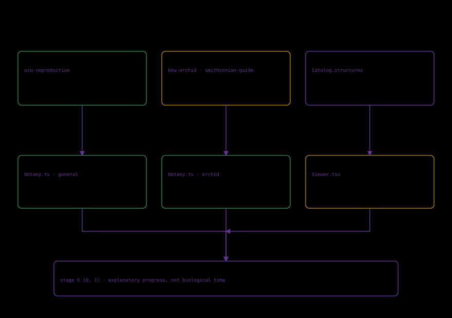

# What each representation establishes

A digitized bloom records an outer surface. Texture/shape support observation, not hidden tissue, pollinator identity or a species' full variation. The five scans have one mesh each and no organ hierarchy.

An authored model supplies explicit components and relationships. Separation, colors, magnification and proportions aid teaching. Explicit does not mean measured. The general flower and orchid are different recipes.

The reproductive sequence is an ordered explanation. Progress is neither real elapsed time nor a likelihood or physiological computation. Transfer does not guarantee fertilization. Ending at seed formation does not simulate germination or establishment.

Keep camera/fidelity consistent when comparing surfaces. Framing does not imply equal physical dimensions. More detail is available representation, not independent proof of biological accuracy.

Sources: [Smithsonian collection](https://gardens.si.edu/exhibitions/future-of-orchids/3d-orchids/), [Kew Orchidaceae](https://powo.science.kew.org/taxon/urn:lsid:ipni.org:names:30000046-2/general-information), [OSU reproductive parts](https://extension.oregonstate.edu/catalog/em-9900-reproductive-plant-parts).
